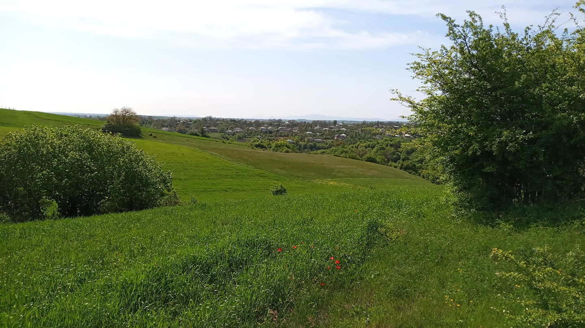

  

<h1 align="center">🏞️ Piral — Qusarın unudulmaz dağ kəndi</h1>

  <em>“Dağların qoynunda, tarixlə nəfəs alan bir kənd — Piral.”</em>

---

## 🏡 Kənd haqqında

**Piral**, Azərbaycanın şimalında, Qusar rayonunun dağlıq bölgəsində yerləşən qədim və mədəni zəngin kəndlərdən biridir.  
Kənd əsrlər boyu öz dəyərlərini qoruyub saxlamış, təbiəti, insanları və adət-ənənələri ilə fərqlənmişdir.

Burada Lezgi mədəniyyətinin izləri, təmiz hava, dağ mənzərələri və dərin tarixi hiss olunur. Kənd əhalisi mehriban, zəhmətkeş və mədəniyyətə bağlı insanlardır.

---

## 📸 Saytda Nələr Tapacaqsınız?

Bu vebsayt **Piral kəndinin tarixi, insanları və gündəlik həyatı** haqqında məlumat vermək üçün yaradılmışdır.

### 🔹 Notable People (Tanınmış şəxslər)
Kəndimizdən çıxmış elm, mədəniyyət və cəmiyyət xadimlərinin bioqrafiyaları və şəkilləri.

### 🔹 Gallery (Qalereya)
Piralın təbiətini, həyat tərzini və insanlarını əks etdirən fotoşəkillər.

### 🔹 News (Xəbərlər)
Kəndlə bağlı yeniliklər, tədbirlər və ictimai fəaliyyətlər.

### 🔹 About & Contact (Haqqımızda və Əlaqə)
Kənd haqqında ümumi məlumat və bizə necə çatmaq olar.

---

## 🌍 Dil Dəstəyi

Sayt **3 dildə** təqdim olunur:
- 🇦🇿 Azərbaycan dili  
- 🇬🇧 İngilis dili  
- 🇷🇺 Rus dili  

İstifadəçi interfeysindəki yazılar JavaScript vasitəsilə dinamik şəkildə tərcümə olunur.

---

## 📱 Texniki Xüsusiyyətlər

- HTML5 + CSS3 + Vanilla JavaScript
- JSON verilənlər bazası ilə xəbərlər və bioqrafiyalar
- Multilingual Translation sistemi
- Tam mobil uyğunluq və Dark Mode
- Gələcəkdə: Admin paneli və dinamik xəbərlər əlavəetmə funksiyası

---

> Bu layihə Piral kəndinin mədəni kimliyini qorumaq və gələcək nəsillərə ötürmək üçün hazırlanmışdır.  
> Saytda yer alan bütün məlumatlar yerli mənbələrə əsaslanır. Əlavə etmək istədiyiniz şəxs və ya məlumat varsa, mənimlə əlaqə saxlaya bilərsiniz.

